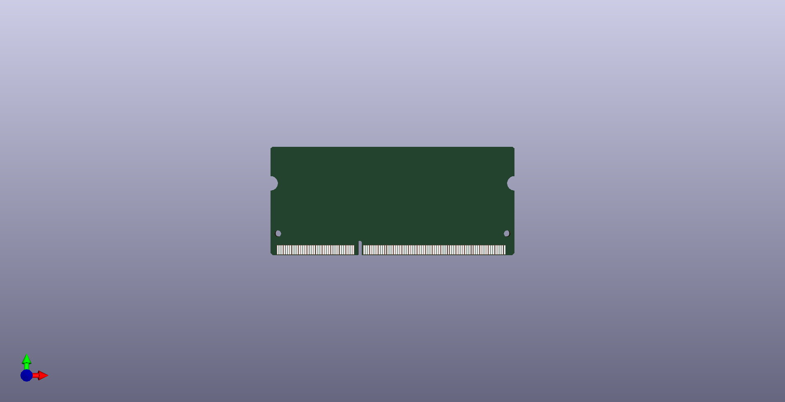

# [DDR3_SODIMM](/DDR3_SODIMM)
## Images
### 3D

### Board image

## Project
[DDR3_SODIMM](DDR3_SODIMM.pro)

## Schematic
[DDR3_SODIMM](DDR3_SODIMM.sch)

## Library
[DDR3_SODIMM](ddr3_sodimm.lib)

## Board
[DDR3_SODIMM](DDR3_SODIMM.kicad_pcb)

## ZIP
[DDR3_SODIMM](DDR3_SODIMM.zip)