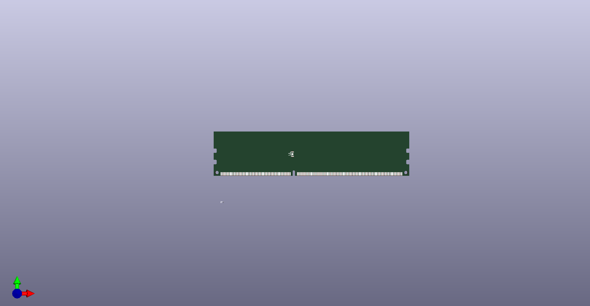

# [DDR3_UDIMM](/DDR3_UDIMM)
## Images
### 3D

### Board image

## Project
[DDR3_UDIMM](DDR3_UDIMM.pro)

## Schematic
[DDR3_UDIMM](DDR3_UDIMM.sch)

## Library
[DDR3_UDIMM](ddr3_udimm.lib)

## Board
[DDR3_UDIMM](DDR3_UDIMM.kicad_pcb)

## ZIP
[DDR3_UDIMM](DDR3_UDIMM.zip)