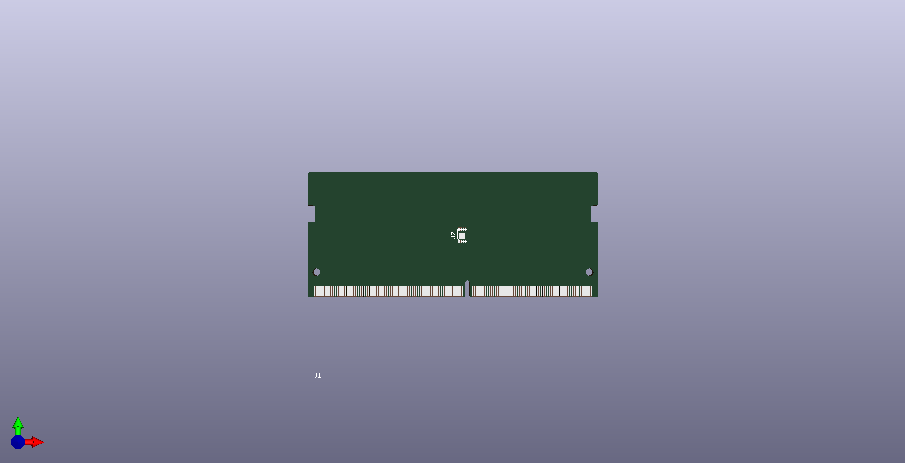

# [DDR4_SODIMM](/DDR4_SODIMM)
## Images
### 3D

### Board image

## Project
[DDR4_SODIMM](DDR4_SODIMM.pro)

## Schematic
[DDR4_SODIMM](DDR4_SODIMM.sch)

## Library
[DDR4_SODIMM](library.sch)

## Board
[DDR4_SODIMM](DDR4_SODIMM.kicad_pcb)