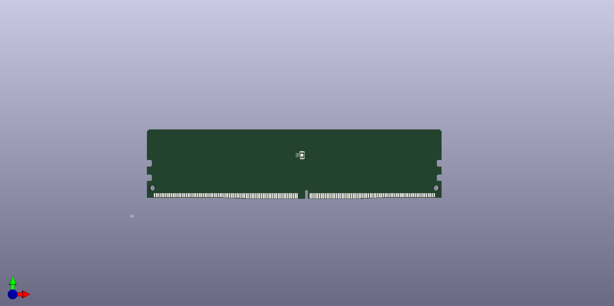

# [DDR4_UDIMM](/DDR4_UDIMM)
## Images
### 3D

### Board image

## Project
[DDR4_UDIMM](DDR4_UDIMM.pro)

## Schematic
[DDR4_UDIMM](DDR4_UDIMM.sch)

## Library
[DDR4_UDIMM](ddr4_udimm.lib)

## Board
[DDR4_UDIMM](DDR4_UDIMM.kicad_pcb)

## ZIP
[DDR4_UDIMM](DDR4_UDIMM.zip)