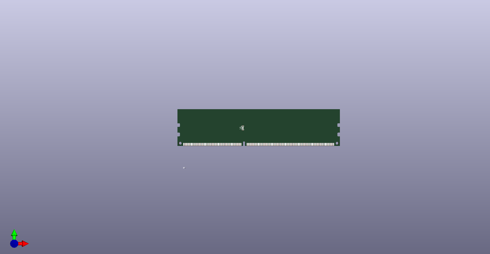
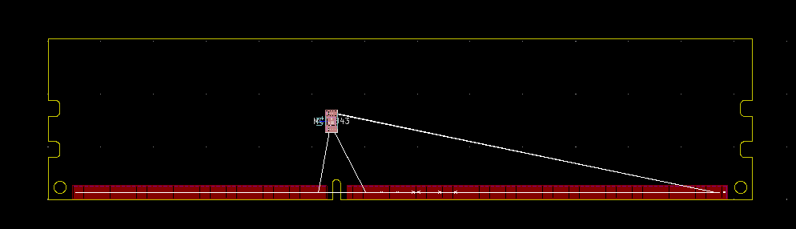
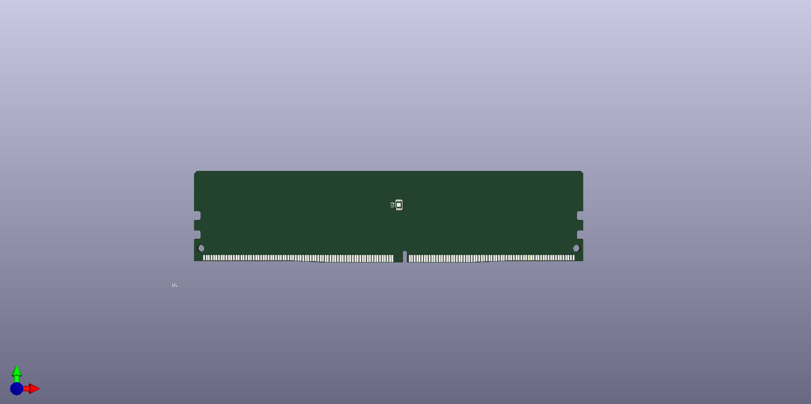

# KiCad_Templates
This is where it will be placed SoC-eame's KiCad templates.
Template's path: "<where_KiCad_is_installed>\KiCad\share\kicad\template\"

## [DDR3_SODIMM](/DDR3_SODIMM)
### 3D

### Board

## [DDR4_SODIMM](/DDR4_SODIMM)
### 3D

### Board

## [DDR3_UDIMM](/DDR3_UDIMM)
### 3D

### Board

## [DDR4_UDIMM](/DDR4_UDIMM)
### 3D

### Board
