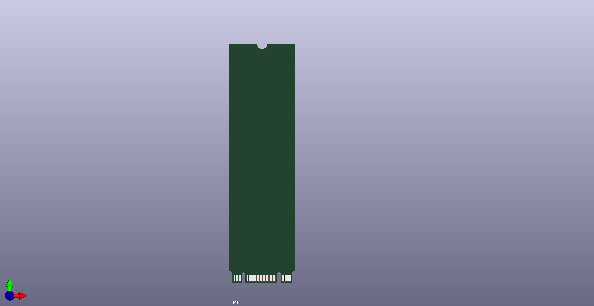
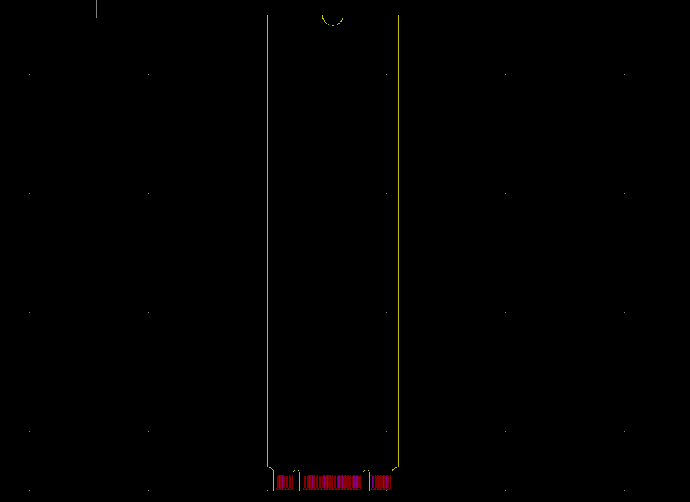

# [SSD_M2_TYPE_2280](/SSD_M2_TYPE_2280)
## Images
### 3D

### Board image

## Project
[SSD_M2_TYPE_2280](SSD_M2_TYPE2280.pro)

## Schematic
[SSD_M2_TYPE_2280](SSD_M2_TYPE2280.sch)

## Library
[SSD_M2_TYPE_2280](ssd_m2_type_2280.lib)

## Board
[SSD_M2_TYPE_2280](SSD_M2_TYPE2280.kicad_pcb)

## ZIP
[SSD_M2_TYPE_2280](SSD_M2_TYPE_2280.zip)